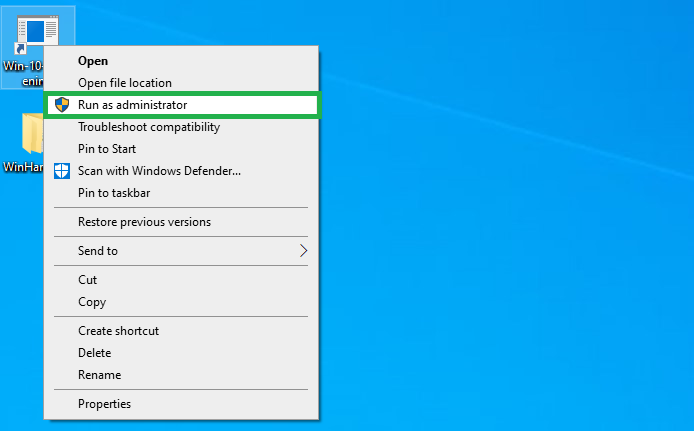
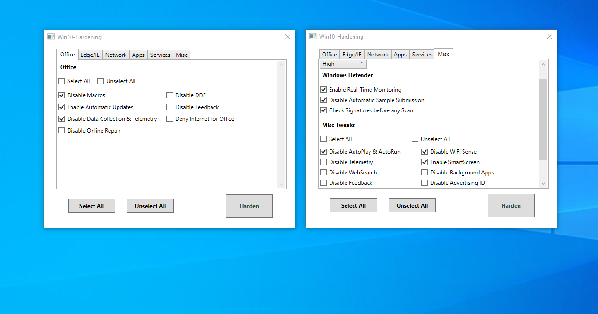
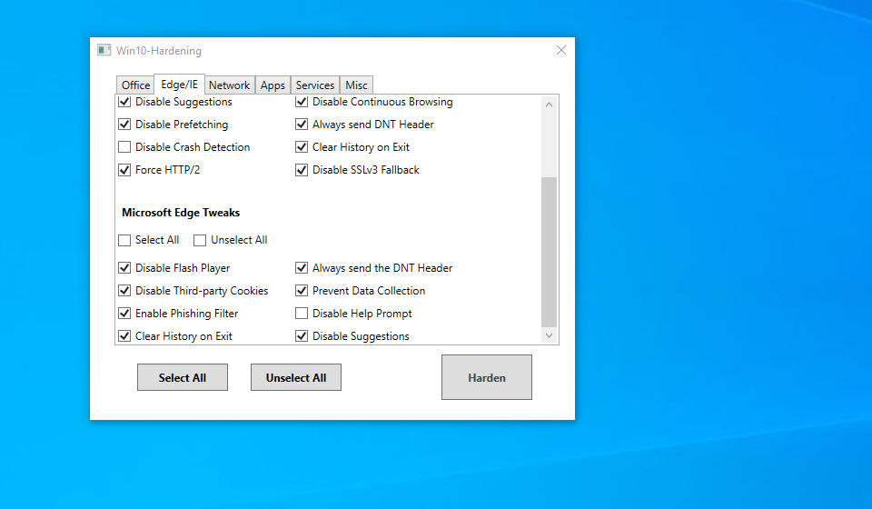

# Windows-10-hardening

### Description
The goal of this project is to improve both privacy and security provided by default in your Windows 10 operating system, either Pro or Home edition.

The Powershell script is intended to harden your OS. It does so by turning on/off some specific features known to have led to several attacks and security vulnerabilities in the paste, or that might affect the privacy of the system users. 
It also uninstalls and disables known services and default applications which are not needed by the majority of the users. 

Thus, it attempts to remove/disable every unneeded application, protocol, and more in general software that stand on your operating system just to increase the attack surface. Among the applications the script removes you can find the Bing and XBox applications that are installed by default and many others. The GUI app on the other hand, allows to select any application or service, despite it is considered useful or not. Thus, select them with caution.

Some of the protocols disabled by the script are mentioned below:
- NetBios
- RDP
- Unsecure SSL and TLS versions
- IPv6

**Note:** The script must be executed with Administrator privileges in order to complete successfully and it also requires a computer restart to apply all the changes. 
  

The script is also provided as a standalone [WPF](https://docs.microsoft.com/en-us/dotnet/framework/wpf/) GUI Windows application, for those that doesn't feel comfortable to read the source code or blindly run a script that wasn't written by them. 
Moreover, the WPF application allows its users to explicitly select/unselect the features they wish to enable/disable or the services and applications they want to stop or uninstall. 

For more information on how to install and run the application, please refer to the [section](#Install-and-Run-the-WPF-Application) below. 

 

### Recommendation

In order to prevent any issue that this script may cause to your system, it's recommended to take a backup of your registry hives before you run it, so that you can restore all the registry keys to their previous values. 
For those that do not want to manually perform the backup, the script saves the registry hives into a directory (chosen by the user) before any change is applied. 

The script uninstall only those applications that are installed by default on every Windows OS and which are not used by the majority of the users. However, you might be among those restricted range of users that need (for instance) the '3D Viewer' application, in that situation you will need to reinstall the software. 

The PS script also disables typically unneeded services, features, and Internet protocols with purpose to improve the security and the privacy provided by your OS. 
For instance it disables some known weak security communication protocols, such as the SSL and the TLS 1.0 protocols, and it stops several services to save memory, power, and especially to reduce the attack surface. The script also disables features like Macro execution, WiFi Sense and applies several changes to IE and Edge browsers.  

Even though the script has been fully tested with no issue on the latest versions of Windows 10 (Home and Pro edition, specifically releases until 21H1) I *do not* assume any responsibility regarding any issue it may cause to your systems. The source code is publicly accessible and therefore you're allowed to inspect its statements or just take/restore a backup as already mentioned before. 

### How to Run the PS Script

Open a CMD prompt and run the following command from the directory that contains the target script:

      powershell -exec bypass ".\os_hardening.ps1"

In case you don't use Windows Defender as your anti-malware solution, run the script as shown below:

    powershell -exec bypass ".\os_hardening.ps1 -NoAV"

### Install and Run the WPF Application

1. Download the [Win10HardeningSetup.zip](https://github.com/ssh3ll/Windows-10-Hardening/releases/download/v1.0/Win10HardeningSetup.zip) archive and extract its content into any directory
2. In order to install the application: double-click the extracted **.msi** file  (**Note:** this will create a shortcut on your Desktop whereas all the files will be stored into the C:\Program Files (x86)\Win10_Hardening_Setup\ directory)

3.1 Just right click the shortcut on your Desktop and "Run as Administrator", as shown below:

3.2 An alternative way to run the application is to open a CMD prompt with Administrator privileges and then run the following two commands:

    cd c:\Program Files (x86)\Win10_Hardening_Setup\
    Win10Hardening.exe
    
Once the application is running it should be really easy to understand the way it works.  
The users are supposed to select/unselect the options available on the several pages whether they want to perform the changes mentioned to the right of each selected option. The *Apps* page allows users select the applications they want to remove whereas the *Services* page allows to stop and prevent specific services to run when your device is turned on.
The next two screenshots depict the current, very simple, GUI of the application.

### Contribution

If you have any idea, advice, or improvement feel free to open an issue or contact me directly. 

Pull requests are welcome!!
